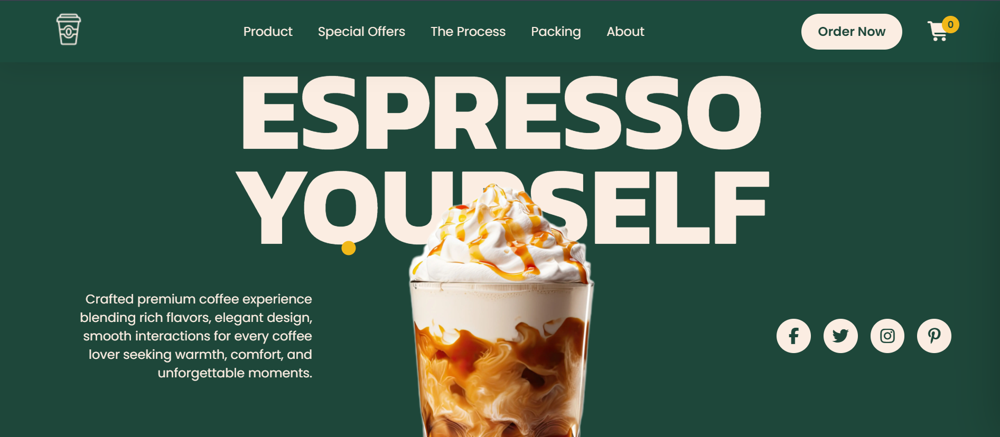
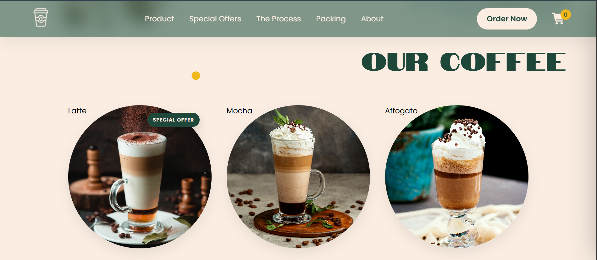
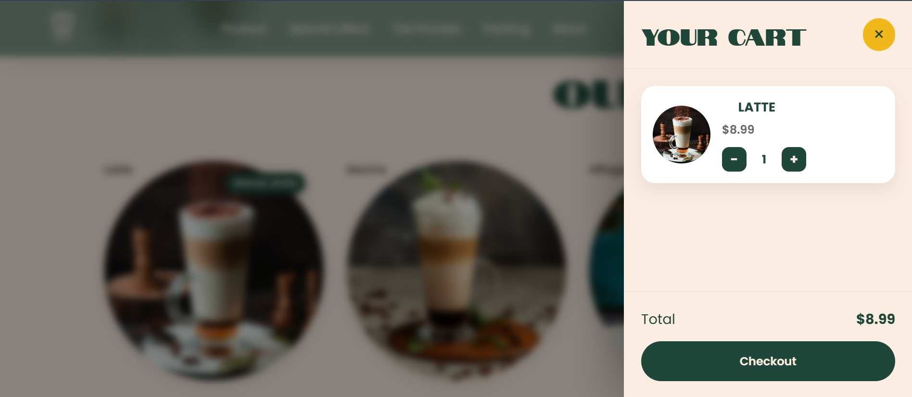

# ☕ Espresso — Premium Coffee Experience

A modern and immersive coffee website built to deliver a **premium café experience through elegant design, smooth interactions, and engaging animations**.

Espresso combines a visually rich interface with interactive coffee products, special offers, shopping cart functionality, checkout flow, and a responsive user experience — all built with **HTML, CSS, and Vanilla JavaScript**.

---

## ✨ Live Demo

🌐 **[View Espresso Live](https://espressocraft.netlify.app/)**

---

## 📂 GitHub Repository

💻 **[View Source Code](https://github.com/Azeem-Toretto-1/Espresso-Premium-Coffee)**

---

## 🚀 Features

* ☕ Premium coffee landing page
* 🎨 Modern and elegant UI design
* ✨ Smooth reveal animations
* 🖱️ Premium custom cursor interactions
* 🧲 Magnetic buttons and interactive cards
* 📱 Responsive design
* 🍵 Interactive coffee product cards
* 🔍 Coffee product details modal
* 🛒 Add-to-cart functionality
* ➕ Increase/decrease product quantity
* 💾 Cart persistence using Local Storage
* 💰 Dynamic cart total calculation
* 🎁 Special offers filtering
* 🔔 Toast notifications
* 🧾 Checkout modal
* 🎉 Order confirmation with confetti animation
* 🔄 Smooth navigation between sections
* ⏳ Premium loading screen
* 🎬 Interactive process section
* 📦 Roasting & packing experience sections

---

## 🛠️ Technologies Used

### Frontend

* HTML5
* CSS3
* JavaScript (ES6+)

### Libraries / Tools

* Font Awesome
* Local Storage API
* Intersection Observer API
* Canvas Confetti

### Deployment

* Netlify

### Development

* Visual Studio Code
* Git
* GitHub

---

## 🧠 What I Practiced

This project helped me strengthen my understanding of:

* DOM manipulation
* JavaScript event handling
* Local Storage
* Dynamic UI rendering
* Array methods
* Product and cart state management
* Intersection Observer API
* CSS animations
* Responsive layouts
* Modal systems
* Interactive navigation
* Form handling
* UI/UX principles
* Clean JavaScript structure

---

## 🛒 Shopping Cart

The project includes a complete interactive cart system.

Users can:

1. Browse coffee products
2. Open product details
3. Add products to the cart
4. Increase or decrease quantities
5. Remove products
6. View the dynamically calculated total
7. Continue to checkout
8. Place an order

Cart data is stored in **Local Storage**, so products remain available after refreshing the page.

---

## 🎨 Design Philosophy

The goal was not simply to build another coffee website.

I wanted to create a digital coffee experience that feels:

> **Premium • Warm • Smooth • Interactive • Memorable**

Every section was designed with a focus on visual hierarchy, motion, interaction, and an overall luxury café aesthetic.

---

## 📸 Preview

Visit the live website to experience the full interface and animations:

👉 **[Espresso — Live Website](https://espressocraft.netlify.app/)**

---

## 📁 Project Structure

```text
Espresso-Premium-Coffee/
│
├── assets/
│   └── images & media
│
├── index.html
├── style.css
├── script.js
└── README.md
```

---

## 📸 Preview

### 🖥️ Desktop



### ☕ Coffee Products



### 🛒 Shopping Cart



---

## ⚙️ Run Locally

Clone the repository:

```bash
git clone https://github.com/Azeem-Toretto-1/Espresso-Premium-Coffee.git
```

Move into the project:

```bash
cd Espresso-Premium-Coffee
```

Then open `index.html` in your browser or use **Live Server** in VS Code.

---

## 🌐 Connect With Me

### 💼 LinkedIn

[linkedin.com/in/azeem-toretto](https://www.linkedin.com/in/azeem-toretto)

### 📸 Instagram

[instagram.com/azeem_dev](https://www.instagram.com/azeem_dev)

### ▶️ YouTube

[youtube.com/@Azeem-Dev-51](https://www.youtube.com/@Azeem-Dev-51)

---

## ⭐ Support

If you like this project, consider giving the repository a ⭐ on GitHub.

It really helps and motivates me to keep building and improving.

---

## 👨‍💻 Author

**Azeem Malik**

Frontend Developer | JavaScript Developer | Creative UI Enthusiast

Built with ☕, 💻 & passion.

---

### 🔗 Project Links

| Platform     | Link                                                                                  |
| ------------ | ------------------------------------------------------------------------------------- |
| 🌐 Live Demo | [EspressoCraft](https://espressocraft.netlify.app/)                                   |
| 💻 GitHub    | [Espresso-Premium-Coffee](https://github.com/Azeem-Toretto-1/Espresso-Premium-Coffee) |
| 💼 LinkedIn  | [Azeem Malik](https://www.linkedin.com/in/azeem-toretto)                              |
| 📸 Instagram | [@azeem_dev](https://www.instagram.com/azeem_dev)                                     |
| ▶️ YouTube   | [Azeem Dev](https://www.youtube.com/@Azeem-Dev-51)                                    |
